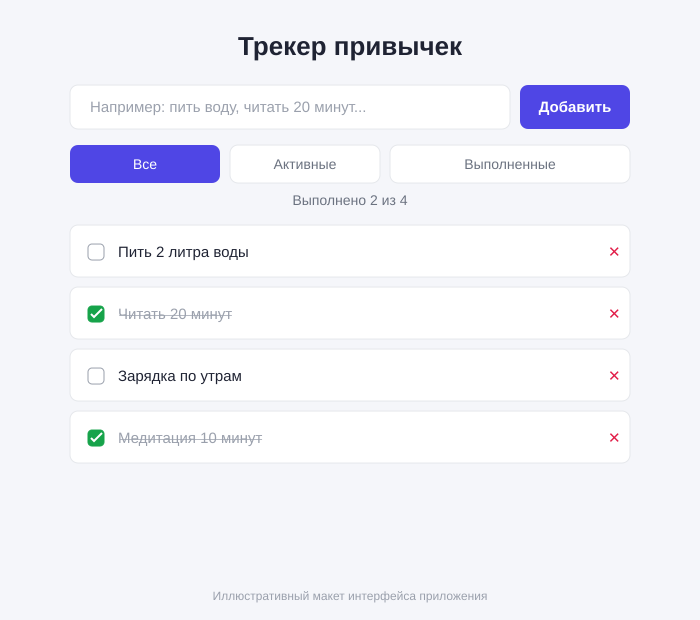
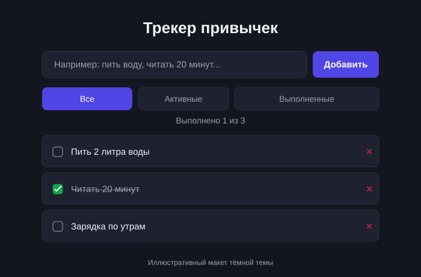

# 📋 Трекер привычек (Habit Tracker)

Небольшое React-приложение для отслеживания ежедневных привычек. Проект сделан как пример для портфолио: без бэкенда, базы данных, Docker или тестов — только фронтенд и `localStorage`.



## ✨ Функционал

- ➕ Добавление новой привычки
- 🗑️ Удаление привычки
- ✅ Отметка привычки как «Выполнено»
- 📃 Список всех привычек
- 🔍 Фильтр: **Все** / **Активные** / **Выполненные**
- 💾 Сохранение всех данных в `localStorage` (данные не пропадают при обновлении страницы)
- 🌗 Поддержка тёмной темы (автоматически, по системным настройкам)
- 🚫 Защита от добавления пустых и дублирующихся привычек

<details>
<summary>🌙 Тёмная тема (скриншот)</summary>



</details>

## 🛠️ Стек технологий

| Технология     | Назначение                          |
|----------------|--------------------------------------|
| React 18       | UI-библиотека                        |
| TypeScript     | Статическая типизация                |
| Vite           | Сборка и dev-сервер                  |
| CSS            | Стилизация (без сторонних UI-либ)    |
| localStorage   | Персистентность данных на клиенте    |
| Git / GitHub   | Контроль версий                      |

Backend, база данных, Docker и тесты сознательно не используются — проект чисто клиентский.

## 🚀 Запуск проекта

```bash
# 1. Клонировать репозиторий
git clone <URL_РЕПОЗИТОРИЯ>
cd habit-tracker

# 2. Установить зависимости
npm install

# 3. Запустить dev-сервер
npm run dev
```

Приложение откроется по адресу, который выведет Vite (обычно `http://localhost:5173`).

### Сборка production-версии

```bash
npm run build   # соберёт проект в папку dist/
npm run preview # локальный просмотр production-сборки
```

## 📁 Структура проекта

```
habit-tracker/
├── public/
│   └── vite.svg              # favicon
├── screenshots/               # скриншоты приложения для README
├── src/
│   ├── components/
│   │   ├── HabitForm.tsx      # форма добавления привычки
│   │   ├── HabitItem.tsx      # одна привычка в списке
│   │   ├── HabitList.tsx      # список привычек
│   │   └── FilterBar.tsx      # переключатель фильтров
│   ├── hooks/
│   │   └── useLocalStorage.ts # хук для синхронизации состояния с localStorage
│   ├── types.ts                # общие TypeScript-типы (Habit, FilterType)
│   ├── App.tsx                 # корневой компонент, вся бизнес-логика
│   ├── App.css                 # стили приложения
│   ├── main.tsx                # точка входа React
│   └── index.css               # глобальные стили и CSS-переменные
├── .gitignore
├── index.html
├── package.json
├── tsconfig.json
├── vite.config.ts
└── README.md
```

## 🤖 Использование AI

При разработке проекта использовался ИИ (ChatGPT) в качестве ассистента. Весь код, сгенерированный или предложенный ИИ, помечен в исходниках соответствующими комментариями:

```ts
// AI-GENERATED: ChatGPT
// AI-ASSISTED: ChatGPT
```

Конкретно ИИ применялся для:

- **`src/hooks/useLocalStorage.ts`** — черновой вариант обобщённого хука для чтения/записи состояния в `localStorage` был предложен ChatGPT (`// AI-ASSISTED: ChatGPT`), затем доработан вручную (обработка ошибок, типизация через generics).
- Обсуждение архитектуры компонентов (разбиение на `HabitForm` / `HabitList` / `HabitItem` / `FilterBar`) и формулировок для README.

Вся остальная логика (управление состоянием в `App.tsx`, компоненты, стили, фильтрация, защита от дублей) написана и проверена вручную.

## 📝 История коммитов

Проект разрабатывался пошагово, с отдельными коммитами на каждый логический шаг: настройка проекта → типы → хуки → компоненты → стилизация → доработки (защита от дублей, адаптивность, тёмная тема) → документация. Полную историю можно посмотреть командой:

```bash
git log --oneline
```

## 📌 Возможные улучшения

- Категории/теги для привычек
- Счётчик серии (streak) выполнения подряд
- Drag-and-drop сортировка списка
- Экспорт/импорт данных в JSON

---

Сделано в учебных/портфолио целях.
